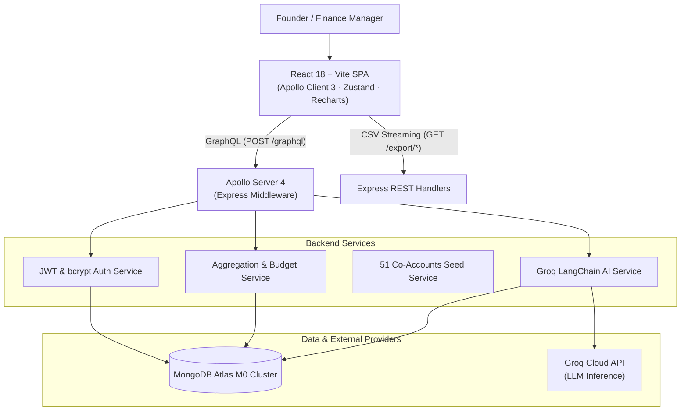

# ExpenseFlow SaaS — Financial Intelligence & Expense Management Platform

> A production-ready, multi-tenant B2B SaaS platform for financial management, multi-company expense tracking, category budgeting, and AI-powered financial advisory. Replaces the legacy n8n/Zoho/Supabase prototype with a 100% self-hosted MERN + GraphQL architecture.

---

## 🌟 Key Capabilities

- 🏢 **Multi-Tenant & Multi-Company Hierarchy**: Manage multiple business entities and subsidiaries under a single isolated organization account.
- ⚡ **High-Performance GraphQL API**: Apollo Server 4 on Express with JWT Bearer authentication, tenant-scoped resolvers, and granular query control.
- 📋 **Bulk Expense & Revenue Ingestion**: Multi-row batch entries for rapid accounting entries with category, subcategory, vendor, and payment method attribution.
- 📊 **Executive Analytics & Reporting**: Real-time KPI summaries, category spend breakdowns, monthly cash flow trends, and vendor distribution.
- 🎯 **Category Budget Buckets & Alerts**: Set spend limits per category with proactive threshold alerts (80% caution, 100% over-budget flags).
- 🤖 **Groq LLM AI Assistant**: Natural language financial chatbot powered by Groq Cloud (`openai/gpt-oss-120b`), LangChain, and MongoDB conversational session memory.
- 📁 **CSV Export & Audit Trail**: Direct CSV data streaming for accounting audits, soft-delete safety, and rate-limiting security.
- 🎨 **Modern SaaS Interface**: Responsive React + Vite application featuring sleek dark mode, glassmorphism UI, accessible navigation, and micro-interactions.

---

## 🏛 Architecture Overview



---

## 📂 Project Structure

```
ExpenceFlow/
├── server/                           # Node.js + Express + Apollo Server 4 backend
│   ├── src/
│   │   ├── config/db.js              # MongoDB Atlas connection + in-memory test fallback + DNS resolution
│   │   ├── middleware/auth.js        # Multi-tenant JWT context injector
│   │   ├── models/                   # 9 Mongoose Schemas (Org, User, Company, Category,
│   │   │                             #   PaymentMethod, Expense, Income, BudgetBucket, ChatSession)
│   │   ├── schema/
│   │   │   ├── typeDefs/             # GraphQL SDL schema definitions
│   │   │   └── resolvers/            # Multi-tenant secured resolvers
│   │   ├── services/                 # Business logic: auth, seed, budget, chat, export
│   │   └── index.js                  # Express app entrypoint & middleware setup
│   ├── tests/                        # 4-phase automated backend verification suites
│   │   ├── phase1.test.js            # DB connection, models, category seed tests
│   │   ├── phase2.test.js            # Auth, Company, Expense/Income CRUD & isolation tests
│   │   ├── phase3.test.js            # Dashboard aggregations & Budget calculation tests
│   │   └── phase4.test.js            # AI Assistant & ChatSession memory tests
│   ├── .env                          # Backend environment variables
│   └── package.json
│
├── client/                           # React 18 + Vite Frontend
│   ├── src/
│   │   ├── assets/css/global.css     # Design tokens, dark mode palette & utility styles
│   │   ├── components/               # Navbar, PageLayout, ChatPanel drawer
│   │   ├── graphql/                  # Apollo Client setup, queries & mutations
│   │   ├── pages/                    # LoginPage, DashboardPage, ExpensesPage, IncomePage,
│   │   │                             #   BudgetsPage, CompaniesPage, CategoriesPage, SettingsPage
│   │   ├── store/authStore.js        # Zustand authentication & company selection state
│   │   ├── App.jsx                   # React Router v6 route configuration
│   │   └── main.jsx
│   ├── .env                          # Frontend environment variables
│   └── package.json
│
├── ExpenseFlow-previous-version/     # Legacy prototype (for reference)
└── README.md
```

---

## 🚀 Quick Start Guide

### Prerequisites
- Node.js >= 18.x
- npm >= 9.x
- MongoDB Atlas connection string (or automated in-memory MongoDB will be used)
- Groq Cloud API key (free tier at [console.groq.com](https://console.groq.com))

---

### 1. Backend Setup

```bash
cd server
npm install
```

Ensure `server/.env` is configured:
```env
MONGODB_URI=mongodb+srv://<username>:<password>@<cluster>.mongodb.net
JWT_SECRET=expenseflow_super_secret_jwt_key_development_2026
JWT_EXPIRY=7d
GROQ_API_KEY=gsk_...
GROQ_MODEL=openai/gpt-oss-120b
PORT=4000
NODE_ENV=development
CLIENT_URL=http://localhost:5173
```

Start the backend server:
```bash
npm start
# Server will run on http://localhost:4000
# GraphQL Playground: http://localhost:4000/graphql
# Health Check: http://localhost:4000/health
```

Run automated backend test suites:
```bash
npm run test:all
```

---

### 2. Frontend Setup

```bash
cd ../client
npm install
```

Ensure `client/.env` is configured:
```env
VITE_GRAPHQL_URI=http://localhost:4000/graphql
VITE_API_URL=http://localhost:4000
```

Start Vite dev server:
```bash
npm run dev
# App will run on http://localhost:5173
```

Production build:
```bash
npm run build
```

---

## 🧪 Verification & Test Results

| Milestone | Scope | Test Suite | Result |
|---|---|---|---|
| **Phase 1** | DB Config, 9 Schemas, 51 Co-Accounts Seed | `tests/phase1.test.js` | **100% Passed** |
| **Phase 2** | JWT Auth, Company CRUD, Bulk Expenses & Income, Tenant Isolation | `tests/phase2.test.js` | **31 / 31 Passed** |
| **Phase 3** | Aggregations (KPIs, Trends, Breakdown), Budget Over-spend alerts | `tests/phase3.test.js` | **32 / 32 Passed** |
| **Phase 4** | Groq AI Chat, LangChain Prompting, Session Persistence & Isolation | `tests/phase4.test.js` | **13 / 13 Passed** |
| **Phase 5** | React 18 SPA, Routing, Form validation, Responsive Dark Theme | Playwright / Browser Agent | **Verified Flawless** |
| **Phase 6** | End-to-End Integration, Live Atlas DB, Live Groq AI Model | `scratch/e2e_test.mjs` | **18 / 18 Passed** |

---

## 🔒 Security & Best Practices

- **Strict Multi-Tenant Isolation**: Every database query, aggregation pipeline, and chat session lookup is strictly filtered by `orgId` extracted from validated JWT claims.
- **Password Security**: Passwords hashed with `bcryptjs` using 12 salt rounds.
- **Rate Limiting**: Express rate limiting enabled to prevent brute-force attacks.
- **Soft Deletions**: Deletion operations flag documents (`isDeleted: true`) rather than performing destructive drops, preventing accidental data loss.
- **Fallback Resilience**: System automatically handles DNS fallback and memory server failovers in offline/restricted network environments.
